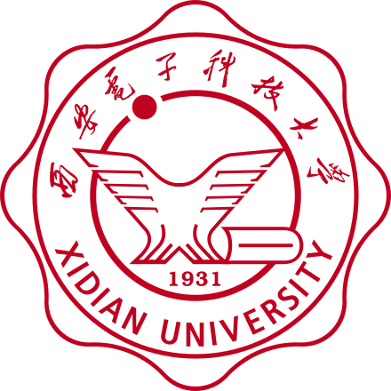

# 欢迎访问我的个人网站

## 个人简介

> <table>
>   <head>
> 		<tr>
> 			<th width="320">萬艼芋</th>
> 			<th width="640">我对下列领域都有浓厚兴趣：</th>
> 		</tr>
> 	</head>
>   <body>
>       <tr>
>           <td rowspan="3" align="center"></td>
>           <td>量化交易、期货投资、股票投资&emsp;&emsp;（详见：<a href="https://www.dywan.xyz/finance">金融&投资</a>）</td>
>       </tr>
>       <tr>
>           <td>C++/Python、机器学习、深度学习&emsp;&emsp;（详见：<a href="https://www.dywan.xyz/program">编程&算法</a>）</td>
>       </tr>
>       <tr>
>           <td>经济、科技、历史&emsp;&emsp;（详见：<a href="https://www.dywan.xyz/journey">知&行</a>）</td>
>       </tr>
>   </body>
> </table>

## 工作经历

> <table>
> 	<head>
> 		<tr>
> 			<th width="320">交通银行</th>
> 			<th width="640">总行-数据管理与应用部</th>
> 		</tr>
> 	</head>
> 	<body>
> 		<tr>
> 			<td rowspan="3" align="center"></td>
> 			<td>金融科技管理培训生</td>
> 		</tr>
> 		<tr>
> 			<td>大数据整合部-模型应用</td>
> 		</tr>
> 		<tr>
> 			<td>正职（就职中）</td>
> 		</tr>
> 	</body>
> </table>

> <table>
> 	<head>
> 		<tr>
> 			<th width="320">字节跳动</th>
> 			<th width="640">Data-商业化技术</th>
> 		</tr>
> 	</head>
> 	<body>
> 		<tr>
> 			<td rowspan="3" align="center"></td>
> 			<td>广告算法岗位</td>
> 		</tr>
> 		<tr>
> 			<td>非中国区商业化-行业变现</td>
> 		</tr>
> 		<tr>
> 			<td>实习（已离职）</td>
> 		</tr>
> 	</body>
> </table>

## 教育经历

> <table>
> 	<head>
> 		<tr>
> 			<th width="320">北京大学</th>
> 			<th width="640">前沿交叉学科研究院</th>
> 		</tr>
> 	</head>
> 	<body>
> 		<tr>
> 			<td rowspan="3" align="center"></td>
> 			<td>数据科学专业</td>
> 		</tr>
> 		<tr>
> 			<td>大数据分析与应用技术国家工程实验室</td>
> 		</tr>
> 		<tr>
> 			<td>硕士（已毕业）</td>
> 		</tr>
> 	</body>
> </table>

> <table>
> 	<head>
> 		<tr>
> 			<th width="320">西安电子科技大学</th>
> 			<th width="640">计算机科学与技术学院</th>
> 		</tr>
> 	</head>
> 	<body>
> 		<tr>
> 			<td rowspan="3" align="center"></td>
> 			<td>软件工程专业</td>
> 		</tr>
> 		<tr>
> 			<td>卓越工程师教育培养计划试点班</td>
> 		</tr>
> 		<tr>
> 			<td>本科（已毕业）</td>
> 		</tr>
> 	</body>
> </table>

## 联系方式

> <table>
>   <head>
> 		<tr>
> 			<th colspan="3" width="960">您可以通过以下方式找到我</th>
> 		</tr>
> 	</head>
>   <body>
>       <tr>
>           <td width="320">PKU邮箱：dywan@stu.pku.edu.cn</td>
>           <td width="320">XDU邮箱：dywan@stu.xidian.edu.cn</td>
>           <td width="320">网易邮箱：wandingyuyemail@163.com</td>
>       </tr>
>       <tr>
>           <td width="320">QQ：1214833800</td>
>           <td width="320">bilibili：<a href="https://space.bilibili.com/177296496">177296496</a></td>
>           <td width="320">知乎：<a href="https://www.zhihu.com/people/wdyzh1997">wdyzh1997</a></td>
>       </tr>
>   </body>
> </table>

---

